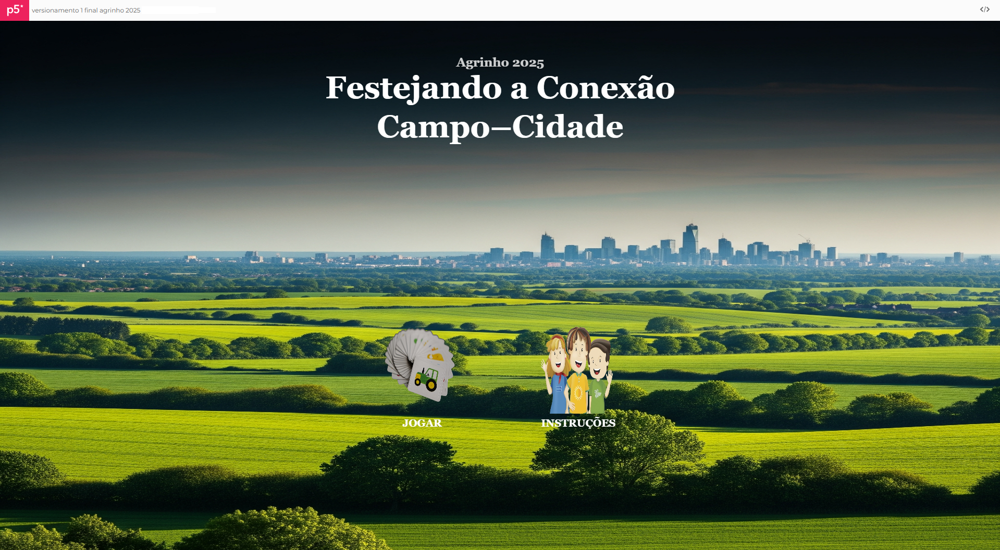

# Projeto Agrinho 2025 - **"Festejando Conexão Campo e Cidade"**

## ▶️ Deploy / Como Executar o Projeto

- [GitHub Pages](https://ayslamilena.github.io/agrinho-2025/)
- [Vercel](https://agrinho-2025-pi-jade.vercel.app/)
- [p5.js Editor - Tela Cheia](https://editor.p5js.org/aysla.ferreira/full/aE6VivKXW)

> É recomendado que o projeto seja acessado através do deploy para evitar sobreposições de elementos.

---

## Sobre o Projeto

Este projeto foi desenvolvido para o **Concurso Agrinho 2025** com o objetivo de criar uma experiência interativa que ilustra a profunda e vital conexão entre o campo e a cidade. Através de elementos gráficos e interatividade, mostramos como esses dois ambientes se complementam, ressaltando a importância mútua para o desenvolvimento sustentável.

🖥️ Construído em **JavaScript** utilizando a biblioteca **p5.js**, o projeto apresenta uma tela dinâmica com representações visuais da vida rural e urbana.

---

## ✨ Pontos de Destaque

- **Jogo da Memória Temático**  
  Cada par encontrado revela uma conexão essencial entre campo e cidade, como "Alimento", "Água", "Energia", entre outros.

- **Transições Suaves**  
  Navegação fluida entre telas de introdução, instruções, jogo e finalização, proporcionando uma jornada agradável para o usuário.

- **Efeitos Visuais Interativos**
  - *Títulos animados* com efeito de fade-in gradual para um toque profissional.
  - *Botões dinâmicos* que reagem ao mouse com efeitos visuais de "foguinhos" coloridos.
  - *Fogos de artifício* aparecem ao clicar, reforçando a sensação de festa.
  - *Sons* recursos sonoros durante o jogo e ativados com o clique.
  - *Vídeo* recurso adicionado para finalizar o projeto.

- **Carregamento Dinâmico de Imagens**  
  Utilização de template strings para carregar imagens das cartas, facilitando futuras expansões do jogo.

---

## Linguagem de Programação

- **JavaScript:** A base de toda a lógica e interatividade do jogo.

## Biblioteca

- **p5.js:** Essencial para a criação gráfica, animações, manipulação de áudio e eventos do usuário.

## Ambiente de Desenvolvimento

- **p5.js Web Editor:** Ambiente online para codificação e prototipagem rápida.
- **GitHub:** Utilizado para versionamento e hospedagem do código-fonte.

### Estrutura Básica

- `setup()`: Configura o ambiente do jogo.
- `draw()`: Loop principal de desenho e lógica.
- `preload()`: Carrega todos os arquivos e mídias antes do jogo começar.

### Desenho e Gráficos

- `createCanvas()`: Cria a área de desenho do jogo.
- `background()`: Define a cor de fundo.
- `image()`: Exibe imagens na tela.
- `rect()`: Desenha retângulos (usados para as cartas).
- `line()`: Desenha linhas (para os efeitos de "fogo de artifício").
- `text()`: Exibe texto na tela.
- `fill()`: Define a cor de preenchimento de formas e texto.
- `stroke()`: Define a cor do contorno de formas.
- `strokeWeight()`: Define a espessura do contorno.
- `noStroke()`: Remove o contorno.
- `tint()`: Aplica um filtro de cor/opacidade a imagens (usado nas transições).
- `noTint()`: Remove o filtro de cor/opacidade.
- Manipulação de cores (`color`, `red`, `green`, `blue`): Para criar e manipular cores.

### Interatividade e Eventos

- `mousePressed()`: Detecta cliques do mouse.
- `dist()`: Calcula a distância entre dois pontos (usado para detecção de clique em botões redondos).
- `millis()`: Retorna o tempo decorrido desde o início do programa (usado para transições e tempo de espera).
- `setTimeout()`: Executa uma função após um certo atraso (usado para virar cartas de volta).

### Animação e Matemática

- `map()`: Mapeia um valor de um intervalo para outro.
- `lerp()`: Interpola linearmente entre dois valores (usado para suavizar o tamanho do botão).
- `random()`: Gera números aleatórios.
- `constrain()`: Restringe um valor a um intervalo específico.
- `shuffle()`: Embaralha os elementos de um array.
- `floor()`: Retorna o maior número inteiro menor ou igual a um número.
- `cos()`, `sin()`, `TWO_PI`: Funções trigonométricas para cálculos de ângulo e movimento.

### Vetores

- `createVector()`: Cria um vetor 2D.
- `p5.Vector`: Objeto de vetor (implícito no createVector para manipulação de coordenadas).

### Mídia (Imagens, Sons e Vídeos)

- `loadImage()`: Carrega arquivos de imagem.
- `loadSound()`: Carrega arquivos de áudio.
- `createVideo()`: Cria um elemento de vídeo para reprodução local.

### Controle de Áudio e Vídeo

**Áudio (p5.SoundFile métodos):**

- `.play()`: Inicia ou retoma a reprodução do som.
- `.pause()`: Pausa a reprodução do som.
- `.stop()`: Para a reprodução do som.
- `.isPlaying()`: Verifica se o som está tocando.
- `.getVolume()`: Obtém o volume atual do som.

**Vídeo (p5.MediaElement métodos):**

- `.hide()`: Esconde o elemento de vídeo HTML.
- `.show()`: Mostra o elemento de vídeo HTML.
- `.volume()`: Define o volume do vídeo.
- `.autoplay()`: Define se o vídeo deve tocar automaticamente.
- `.pause()`: Pausa a reprodução do vídeo.
- `.stop()`: Para a reprodução do vídeo.
- `.size()`: Define o tamanho do elemento de vídeo.
- `.position()`: Define a posição do elemento de vídeo.

### Classes Personalizadas

- **Carta:** Define as propriedades e o comportamento de cada carta no jogo da memória.
- **BotaoRedondo:** Define as propriedades e o comportamento dos botões interativos.
- **Risco:** Define as propriedades e o comportamento dos elementos visuais de "fogo de artifício".

---

## 📚 Links usados para consulta e aprofundamento

Para o desenvolvimento do projeto e consulta de recursos foi utilizado:

- **p5.js - Documentação Oficial:**  
  [https://p5js.org/reference/](https://p5js.org/reference/)

- **Mozilla Developer Network (MDN) - JavaScript:**  
  [https://developer.mozilla.org/pt-BR/docs/Web/JavaScript](https://developer.mozilla.org/pt-BR/docs/Web/JavaScript)

- **Aprofundamento em aulas do YouTube:**  
  [https://www.youtube.com/@pattvira/videos](https://www.youtube.com/@pattvira/videos)  
  [https://www.youtube.com/@TheCodingTrain](https://www.youtube.com/@TheCodingTrain)

---

## **Atribuição de Imagens, Sons e Vídeos**

Durante o desenvolvimento deste projeto, foram utilizados recursos visuais e sonoros de fontes livres, seguindo as melhores práticas de atribuição.

---

### 🖼️ Imagens:

| Nome/Descrição | Fonte / Autor | Licença |
|---|---|---|
| trigo-campo-campo-de-trigo-cevada | [Pixabay](https://pixabay.com/pt/photos/trigo-campo-campo-de-trigo-cevada-2549245/) | Gratuita |
| pão-cozido-comida-fresquinhos | [Pixabay](https://pixabay.com/pt/photos/p%C3%A3o-cozido-comida-fresquinhos-1281053/) | Gratuita |
| vaca-vaca-normal-vaca-de-leite | [Pixabay](https://pixabay.com/pt/photos/vaca-vaca-normal-vaca-de-leite-7957275/) | Gratuita |
| vaca-leite-vaca-de-leite-branco | [Pixabay](https://pixabay.com/pt/photos/vaca-leite-vaca-de-leite-branco-4909684/) | Gratuita |
| rio-outono-arvores-folhas-folhagem | [Pixabay](https://pixabay.com/pt/photos/rio-outono-arvores-folhas-folhagem-219972/) | Gratuita |
| agua-gotas-respingo | [Pixabay](https://pixabay.com/pt/photos/agua-gotas-respingo-got%C3%ADcula-4967843/) | Gratuita |
| madeira-pilha-troncos-de-árvore | [Pixabay](https://pixabay.com/pt/photos/madeira-pilha-troncos-de-%C3%A1rvore-1868104/) | Gratuita |
| carpinteiro-avião-aparas-de-madeira | [Pixabay](https://pixabay.com/pt/photos/carpinteiro-avi%C3%A3o-aparas-de-madeira-4015109/) | Gratuita |
| grãos-de-café-café-cafeína | [Pixabay](https://pixabay.com/pt/photos/gr%C3%A3os-de-caf%C3%A9-caf%C3%A9-cafe%C3%ADna-7126154/) | Gratuita |
| café-café-moído-cafeteria | [Pixabay](https://pixabay.com/pt/photos/caf%C3%A9-caf%C3%A9-mo%C3%ADdo-cafeteria-206142/) | Gratuita |
| energia-fluxo-agua | [Pixabay](https://pixabay.com/pt/photos/energia-fluxo-agua-2976738/) | Gratuita |
| luminária-luz-mão-idéia-lâmpada | [Pixabay](https://pixabay.com/pt/photos/lumin%C3%A1ria-luz-m%C3%A3o-id%C3%A9ia-l%C3%A2mpada-2663053/) | Gratuita |
| agricultor-agricultura-campos | [Pixabay](https://pixabay.com/pt/photos/agricultor-agricultura-campos-8294716/) | Gratuita |
| Feira cidade | [Google](https://images.app.goo.gl/e4cUGnKpVvGXcYWL9) | Creative Commons - Ramiro Furquim |
| abelhas-apicultura-apiário-colmeias | [Pixabay](https://pixabay.com/pt/photos/abelhas-apicultura-api%C3%A1rio-colmeias-7170198/) | Gratuita |
| querida-amarelo-apicultor-natureza | [Pixabay](https://pixabay.com/pt/photos/querida-amarelo-apicultor-natureza-1958464/) | Gratuita |
| zangão-vôo-câmera-controle-remoto | [Pixabay](https://pixabay.com/pt/photos/zang%C3%A3o-v%C3%B4o-c%C3%A2mera-controle-remoto-1866742/) | Gratuita |
| Uma pessoa trabalhando em um equipamento em uma mesa | [Unsplash](https://unsplash.com/pt-br/fotografias/uma-pessoa-trabalhando-em-um-equipamento-em-uma-mesa-3PJNIvkf-Tw) | Gratuita |
| a-criação-de-galinhas-poedeira | [Pixabay](https://pixabay.com/pt/photos/a-cria%C3%A7%C3%A3o-de-galinhas-poedeiras-4133960/) | Gratuita |
| ovo-frito-frigideira-refeição-grade | [Pixabay](https://pixabay.com/pt/photos/ovo-frito-frigideira-refei%C3%A7%C3%A3o-grade-3238173/) | Gratuita |
| imagem tela inicial - Gerado por IA | [Gemini](https://gemini.google.com/?hl=pt-BR) | Imagem gerada por Gemini |
| imagem bonecos agrinho | [Programa Agrinho](https://www.sistemafaep.org.br/wp-content/uploads/2016/03/agrinho-2.jpg) | CC BY-NC (sem fins comerciais) |

---

### 🎶 Sons:

| Nome/Descrição | Fonte / Autor | Licença |
|---|---|---|
| EDM Loop | [Pixabay](https://pixabay.com/pt/sound-effects/edm-loop-319038/) | Gratuita |
| Winning Loop | [Pixabay](https://pixabay.com/pt/sound-effects/winning-loop-228639/) | Gratuita |
| Traffic in City | [Pixabay](https://pixabay.com/pt/sound-effects/traffic-in-city-309236/) | Gratuita |
| Passarinho | [Pixabay](https://pixabay.com/pt/sound-effects/passarinho-325866/) | Gratuita |

---

### ▶️ Vídeo:

Criação própria. Necessário usar [Freeconvert](https://www.freeconvert.com/pt/video-compressor) para diminuir qualidade do vídeo, caso contrário não seria possível fazer upload.

