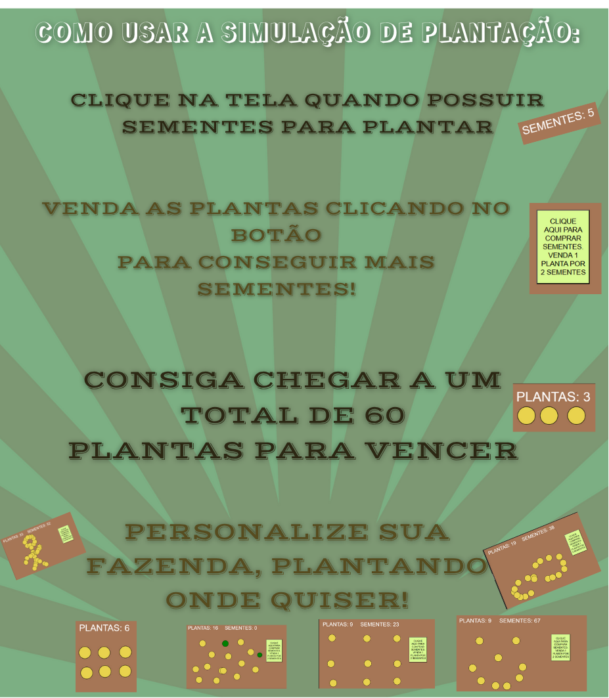

# Plantacao_Agrinho_2025

# :seedling: PLANTAÇÃO NO JAVASCRIPT, USANDO P5.JS! :seedling:

Projeto que simula o ato de plantar! Para o Agrinho 2025!

Plante e venda para conseguir mais sementes.

Conseguindo a fantástica fazenda de 60 plantas, você completa o desafio!

# :sun_with_face: COMO USAR O PROJETO :sun_with_face:

# :ear_of_rice: TESTE NO GITHUB PAGES! :ear_of_rice:

# [:leaves: É SÓ CLICAR AQUI :leaves:](https://colegioconta.github.io/Plantacao_Agrinho_2025/)

# CRÉDITOS

DESENVOLVIDO ATRAVÉS DO P5.JS. ACESSE: https://editor.p5js.org/

PARTE GRÁFICA FEITA COM CANVA. ACESSE: https://www.canva.com/pt_br/

